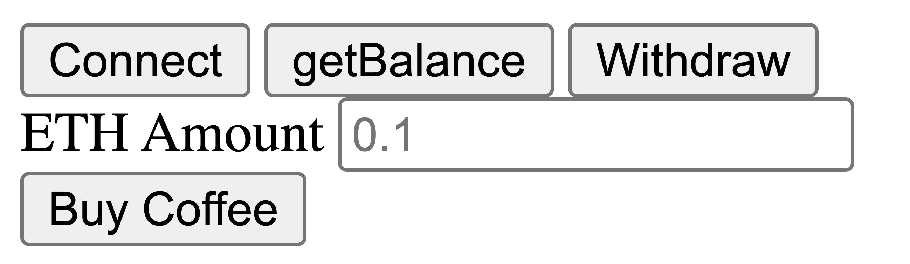
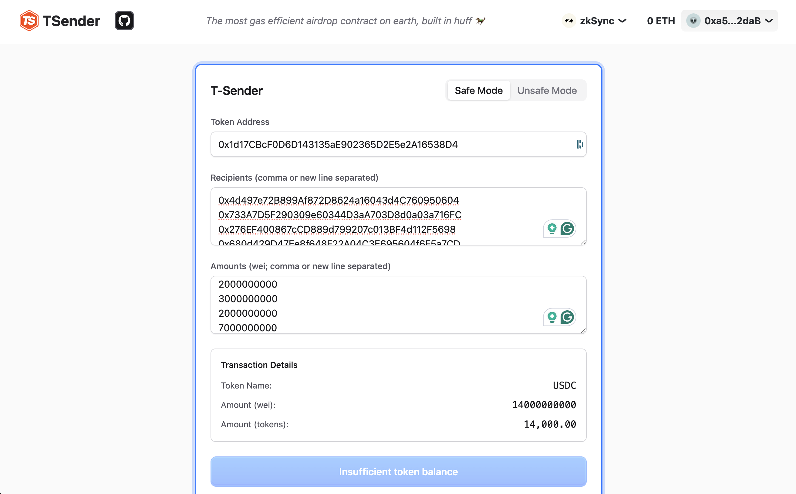
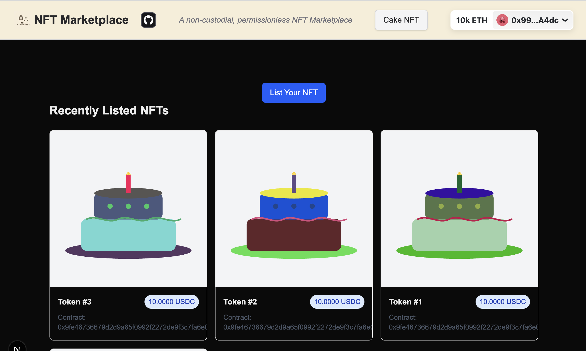
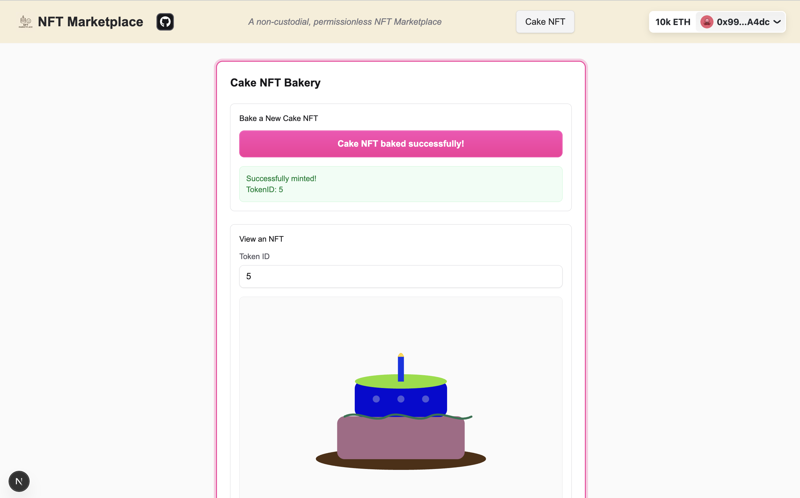

[contributors-shield]: https://img.shields.io/github/contributors/cyfrin/full-stack-web3-cu.svg?style=for-the-badge
[contributors-url]: https://github.com/cyfrin/full-stack-web3-cu/graphs/contributors
[forks-shield]: https://img.shields.io/github/forks/cyfrin/full-stack-web3-cu.svg?style=for-the-badge
[forks-url]: https://github.com/cyfrin/full-stack-web3-cu/network/members
[stars-shield]: https://img.shields.io/github/stars/cyfrin/full-stack-web3-cu.svg?style=for-the-badge
[stars-url]: https://github.com/cyfrin/full-stack-web3-cu/stargazers
[issues-shield]: https://img.shields.io/github/issues/cyfrin/full-stack-web3-cu.svg?style=for-the-badge
[issues-url]: https://github.com/cyfrin/full-stack-web3-cu/issues
[license-shield]: https://img.shields.io/github/license/cyfrin/full-stack-web3-cu.svg?style=for-the-badge
[license-url]: https://github.com/cyfrin/full-stack-web3-cu/blob/master/LICENSE.txt
[linkedin-shield]: https://img.shields.io/badge/-LinkedIn-black.svg?style=for-the-badge&logo=linkedin&colorB=555

<h1> Fullstack Web3 & Blockchain, AI Vibe Coding - Beginner to Expert Crash Course </h1>

<strong>Learn javascript, the tooling needed for a web3 dapp, the power to win a hackathon, and level up your career
</strong>

[![Stargazers][stars-shield]][stars-url] [![Forks][forks-shield]][forks-url]
[![Contributors][contributors-shield]][contributors-url]
[![Issues][issues-shield]][issues-url]
[![GPLv3 License][license-shield]][license-url]

<!-- 

     
    

     

 -->

This repository houses course resources and [discussions](https://github.com/Cyfrin/full-stack-web3-cu/discussions) for the course.

Please refer to this for an in-depth explanation of the content:

- [Website](https://updraft.cyfrin.io) - Join Cyfrin Updraft and enjoy 50+ hours of smart contract development courses
- [Twitter/X](https://twitter.com/CyfrinUpdraft) - Stay updated with the latest course releases
- [LinkedIn](https://www.linkedin.com/school/cyfrin-updraft/) - Add Updraft to your learning experiences
- [Discord](https://discord.gg/cyfrin) - Join a community of 3000+ developers and auditors
- [Newsletter](https://cyfrin.io/newsletter) - Weekly security research tips and resources to level up your career
- [Codehawks](https://codehawks.com) - Smart contracts auditing competitions to help secure web3

Cyfrin Updraft Courses:

- *Coming soon...*

# Table of Contents
- [Table of Contents](#table-of-contents)
- [Tools](#tools)
  - [Tools we cover in this course](#tools-we-cover-in-this-course)
- [Suppport](#suppport)
  - [AI Frens](#ai-frens)
  - [Best Practices](#best-practices)
- [Sections](#sections)
  - [Section 1: HTML/JS - Buy Me A Coffee](#section-1-htmljs---buy-me-a-coffee)
  - [Section 2: React/NextJS Static Site - Token Airdropper UI](#section-2-reactnextjs-static-site---token-airdropper-ui)
  - [Section 3: React/NextJS Dynamic Site - NFT Marketplace](#section-3-reactnextjs-dynamic-site---nft-marketplace)
- [Congratulations](#congratulations)
- [Where do I go now?](#where-do-i-go-now)
  - [Learning More](#learning-more)
  - [Community](#community)
  - [Hackathons](#hackathons)
- [Disclosures](#disclosures)
- [Sponsors](#sponsors)
- [Thank you](#thank-you)
- [License](#license)

# Tools

## Tools we cover in this course

- `javascript/typescript`
  - [viem](https://viem.sh/)
  - [wagmi](https://wagmi.sh/)
  - [synpress]*https://synpress.io/
- [rindexer](https://github.com/joshstevens19/rindexer/issues)
- [Circle/USDC](https://developers.circle.com/w3s/smart-contract-platform)
  - [Compliance Engine](https://developers.circle.com/w3s/compliance-engine)
  - [USDC](https://etherscan.io/token/0xa0b86991c6218b36c1d19d4a2e9eb0ce3606eb48)
- [Fleek](https://fleek.xyz/)
  - Site hosting
  - CLI

# Suppport

- [Github Discussions](https://github.com/Cyfrin/full-stack-web3-cu/discussions)
  - Ask questions and chat about the course here!
- [Stack Exchange Ethereum](https://ethereum.stackexchange.com/)
  - Great place for asking technical questions about Ethereum
- [Peeranha](https://peeranha.io/)
  - Decentralized Stack Exchange!

## AI Frens

*Top picks:*
- [claude.ai](https://claude.ai/)
- [cursor IDE](https://www.cursor.com/)
- [ChatGPT](https://chat.openai.com/)
- [Gemini](https://gemini.google.com/)

*Also good:*
- [Phind](https://www.phind.com/)
  - Like ChatGPT, but it searches the web
- [Other AI extensions](https://twitter.com/aisolopreneur/status/1654823630155464704?s=42&t=-pu_sCYtfrfPJU7OXfifrQ)

## Best Practices

- **Follow the repository:** While going through the course be 100% certain to follow along with the github repository. If you run into an issue check the chronological-updates in the repo.
- **Be Active in the community:** Ask questions and engage with other developers going through the course in the discussions tab, be sure to go and say hello or gm! This space is different from the other industries, you don't have to be secretive; communicate, network and learn with others :)
- **Learn at your own pace:** It doesn't matter if it takes you a day, a week, a month or even a year. Progress >>> Perfection
- **Take Breaks:** You will exhaust your mind and recall less if you go all out and watch the entire course in one sitting.
  **Suggested Strategy** every 25 minutes take a 5 min break, and every 2 hours take a longer 30 min break
- **Refer to Documentation:** Things are constantly being updated, so whenever Patrick opens up some documentation, open it on your end and maybe even have the code sample next to you.
- **Use ChatGPT and/or the course chat**

# Sections

## Section 1: HTML/JS - Buy Me A Coffee

        

💻 Code: [https://github.com/Cyfrin/html-ts-coffee-cu](https://github.com/Cyfrin/html-ts-coffee-cu)

A minimal app where we show you the basics of building a website to interact with web3!

## Section 2: React/NextJS Static Site - Token Airdropper UI

        

💻 Code: [https://github.com/Cyfrin/ts-tsender-cu](https://github.com/Cyfrin/ts-tsender-cu)

A completely static app you can deploy to IPFS or Fleek to interact with a smart contract! This is actually a live site as well!

Site: [t-sender.com](https://t-sender.com/)

## Section 3: React/NextJS Dynamic Site - NFT Marketplace

        
        

💻 Code: [https://github.com/Cyfrin/ts-nft-marketplace-cu](https://github.com/Cyfrin/ts-nft-marketplace-cu)

A dynamic site where we teach you how to interact with services with your app, like:

- Fleek functions
- Circle compliance engine
- Indexers

And more!

(<a href="#table-of-contents">back to top</a>) ⬆️

# Congratulations

🎊🎊🎊🎊🎊🎊🎊🎊🎊🎊🎊🎊 Completed all The Course! 🎊🎊🎊🎊🎊🎊🎊🎊🎊🎊🎊🎊

# Where do I go now?

## Learning More

- [Top 10 learning resources](https://patrickalphac.medium.com/top-10-smart-contract-solidity-developer-learning-resources-cb9d60dd1146)
- [Patrick Collins](https://www.youtube.com/channel/UCn-3f8tw_E1jZvhuHatROwA)
- [CryptoZombies](https://cryptozombies.io/)
- [Ethereum.org](https://ethereum.org/en/)

## Community

- [Twitter](https://twitter.com/PatrickAlphaC)
- [Ethereum Discord](https://ethereum.org/en/)
- [Reddit ethdev](https://www.reddit.com/r/ethdev/)

## Hackathons

- [CL Hackathon](https://chain.link/hackathon)
- [ETH Global](https://ethglobal.co/)
- [ETH India](https://twitter.com/ETHIndiaco)

Be sure to check out project grant programs!

And make today an amazing day!

(<a href="#table-of-contents">back to top</a>) ⬆️

# Disclosures

Transparency is important! So we want to disclose any potential conflicts that might have affected my judgement so you can pick tools that are right for you. Patrick is co-founder of Alpha Chain, a blockchain infrastructure company. Alpha Chain runs **Chainlink, Ethereum, Binance, Polygon, Harmony, Solana, Moonbeam, and Moonriver blockchain services.** Patrick is the co-founder of Cyfrin, and they do smart contract security & auditing services. Patrick is also the co-founder of Chain Accel, who is an advisor on the Peeranha project.

Because of all this, I have added alternatives to each section where we suggest a tool.

# Sponsors

A huge thank you to our sponsors. These are the groups and technologies:

- [Matter Labs (ZKsync)](https://zksync.io/)
- [Fleek](https://fleek.xyz/)
- [Gashawk](https://www.gashawk.io/)

(<a href="#table-of-contents">back to top</a>) ⬆️

# Thank you

Thanks to everyone who is taking, participating in, and working on this course. It's been a passion project and a data dump of everything I've learnt in the web3 space to get you up to speed quickly. Also, a big thank you to Cyfrin & Chain Accel for encouraging this course to come to light, and many, many, many people from the community.

And thanks to the [Cyfrin](https://www.cyfrin.io/) team for making this possible!

# License

Cyfrin Updraft content is open-sourced [licensed as GPLv3](https://github.com/cyfrin/full-stack-web3-cu/blob/main/LICENSE).

(<a href="#table-of-contents">back to top</a>) ⬆️
